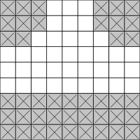

# The PGTG Environment
PGTG procedurally generates a map consisting of multiple road tiles or loads a preconstructed map from a file. The goal is to drive from the start of the map to the goal. The navigation task is not part of this environment, instead a shortest path is provided and marked on the map.

Random maps are generated by combining simple tiles like those, into complex maps.  



  


The environment is highly customizable, for more details see the [list of constructor arguments](Constructor_Arguments.md).

## Action Space
ProcGrid Traffic Gym has a `Discrete(9)` action space.

| Value | Meaning                   |
|-------|---------------------------|
| 0     | accelerate left and up    |
| 1     | accelerate left           |
| 2     | accelerate left and down  |
| 3     | accelerate up             |
| 4     | don't accelerate          |
| 5     | accelerate down           |
| 6     | accelerate right and up   |
| 7     | accelerate right          |
| 8     | accelerate right and down |

## Observation Space

ProcGrid Traffic Gym has a `Dict` observation space that contains the agents current relative position, current velocity, and the currently visible part of the map.

| Key | Type | Explanation |
|-----|------|-------------|
|`"position"`| `MultiDiscrete` | The x and y position of the agent within the visible part of the map. If a sliding observation window is used this ia always `(0, 0)`. |
|`"velocity"`| `Box` | The velocity of the agent in x and y direction. |
|`"map"`| `Dict` | The currently visible part of the map. The keys are the name of the features (`"walls"`, `"goals"`, `"ice"`, `"broken road"`, `"sand"`, `"traffic"`, `"traffic_light_green"`, `"traffic_light_yellow"`, and `"traffic_light_red"`). Each item is a `MultiBinary` that encodes the occurrence of that feature as a hot-one encoding. |
|`"next_subgoal_direction"`| `Discrete(5)` | The direction of the next subgoal or `-1` if there is no next subgoal (most likely because the agent took a wrong turn). __This is disabled by default. It can be enabled with the `use_next_subgoal_direction` argument of the environment constructor.__|

Many reinforcement learning implementations can't deal with `Dict` observations directly, thus it might be necessary to flatten them. Gymnasium provides the `gymnasium.wrappers.FlattenObservation` wrapper for doing so easily:
```python
from gymnasium.wrappers import FlattenObservation
env = FlattenObservation(env)
```

### Fixed Observation Window
By default the map tile (a 9 x 9 squares pice of the map) the agent is currently inside is shown in the observation.

In the animation above the observable part of the map is the bright area.

### Sliding Observation Window
Alternatively the part of the map surrounding the agent can be visible. This behavior can be enabled by setting `use_sliding_observation_window` to `True` and its size can be controlled by `sliding_observation_window_size`, for more details see the [list of constructor arguments](Constructor_Arguments.md). When a sliding observation window is used, sometimes squares outside of the map are observed. In that case they are treated as containing walls and no other features.

In the animation above the observable part of the map is the bright area.

## Reward
Reaching a subgoal or the final goal for the first time in an episode is rewarded. By default that reward is `+100 / number of subgoals`.

Moving into a wall or traffic is punished with and ends the episode. By default the punishment lowers the reward by `-100`. Running a red light is punished but does not end the episode, the default punishment is `-50`.

Standing still or moving to a square already visited this episode can also penalized but is not per default.

All reward values can be customized, for more details see the [list of constructor arguments](Constructor_Arguments.md).

## Render modes
PGTG implements the render modes `"human"`, `"rgb_array"`, and `"pil_image"`. The render mode can be chosen with the constructor argument `render_mode`.

| Value | Explanation |
|-------|-------------|
|`"human"`| `render()` returns `None` but a pygame window showing the environment is opened and automatically advanced whenever `step()` is called. |
|`"rgb_array"`| `render()` returns a `np.array` representing a image. |
|`"pil_image"`| `render()` returns a `PIL.Image.Image`, useful for displaying inside jupiter notebooks. |
|`None`| `render()` returns a `None` |

## Obstacles and Traffic
Obstacles with different effects can be generated.  


### Obstacles

| Name | Default Probability | Effect |
|------|---------------------|--------|
| Ice |0.1| When driving over a square with ice, there is a chance the agent moves in a random direction instead of the expected one. |
| Sand |0.2|When driving over sand, there is a chance that the agent is slowed, as the velocity is reset to 0. |
| Broken road |0.1| When driving over broken road, there is a chance for the agent to get a flat tire. This slows the agent down, as the velocity is reset to (0,0) every step. A flat tire lasts until the end of the episode.|
| Traffic Lights | N/a | Traffic lights switch from green to yellow to red and to green again. Driving through a red light results in a penalty. |

The probability of obstacles triggering, how frequent and which of type they are generated, the traffic light phases, and the red light penalty can be customized, for more details see the [list of constructor arguments](Constructor_Arguments.md).

### Traffic
Traffic always stays in the right lane and moves one square per step. When on a crossing or t-crossing tile traffic chooses randomly whether or not to make a turn. Traffic can leave the map at the border or in deads end tiles, when it does a new traffic car is immediately created at a map border or dead ent tile. Thus the number of traffic card always stays the same.

The density of traffic can be customized, for more details see the [list of constructor arguments](Constructor_Arguments.md).